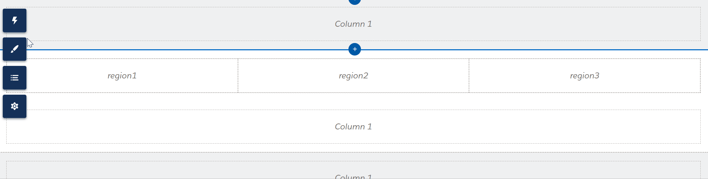
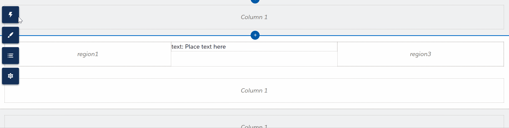

Lightning Web Runtime, or LWR for short was released back in [Spring 21 (v51.0)](https://help.salesforce.com/s/articleView?id=release-notes.rn_experiences_developers_lwr.htm&release=230&type=5). Even before the release of LWR, most developers dreamed of being able to build custom nested components. We could see that OOTB (Out Of The Box) components could use them (see Tabs component).

Salesforce recently released the ability to build custom LWCs with child `<slot/>`'s, to allow nesting of components. Nested LWCs allow you to compose multiple components together into a single component. The child components maintain their own life cycle and can communicate with each other through events, making it easy to create flexible and dynamic apps.

> [!warning]
> Before continuing, Aura based Communities are (sadly) not supported. So if you're currently using them it might be time to make the switch to LWR.

## Code Example

Enough talk, lets jump into the code and see the magic happen.

### HTML

We'll start by creating the HTML template to hold our `<slot/>`'s.

```html
<template>
  <template if:false={isAura}>
    <div class="container">
      <div>
        <slot name="region1"></slot>
      </div>
      <div>
        <slot name="region2"></slot>
      </div>
      <div>
        <slot name="region3"></slot>
      </div>
    </div>
  </template>
</template>
```

### JavaScript

Now lets have a look at the JavaScript. The important part (or magic) here is the `@slot` definitions in the comment directly above the LWC export. Without these definitions, the dynamic components will not work.

The `isAura` check also ensures this component shows a warning in the experience builder when it is being used from within an Aura based community.

```javascript
import { LightningElement } from 'lwc'

/**
 * @slot region1
 * @slot region2
 * @slot region3
 */
export default class NestedLWCs extends LightningElement {
  get isAura() {
    return window['$A'] !== undefined && window['$A'] !== null
  }
}
```

### Metadata XML

Make sure your `.xml` file is setup to be available in the experience builder. The key values are setting `isExposed` to `true` and including both `lightningCommunity__Page` and `lightningCommunity__Default` as `targets`.

```xml
<?xml version="1.0" encoding="UTF-8"?>
<LightningComponentBundle xmlns="http://soap.sforce.com/2006/04/metadata">
  <apiVersion>57.0</apiVersion>
  <isExposed>true</isExposed>
  <masterLabel>Nested LWCs</masterLabel>
  <description>Nested LWC magic</description>
  <targets>
    <target>lightningCommunity__Page</target>
    <target>lightningCommunity__Default</target>
  </targets>
</LightningComponentBundle>
```

## Experience Builder

Now lets open up the Experience Builder and see our custom LWC in action.



We can also nest components within other nested components. I am not aware of any limitation here. I was able to place up to 10 levels deep without any issues, noting theses are very barebones test LWCs. More complex LWCs may start affecting performance.



## Wrapping Up

In summary, nested LWCs provide a powerful and flexible way for developers to create custom components that can be composed of multiple other components, making it easier to build dynamic and reusable apps on the Experience Cloud platform.